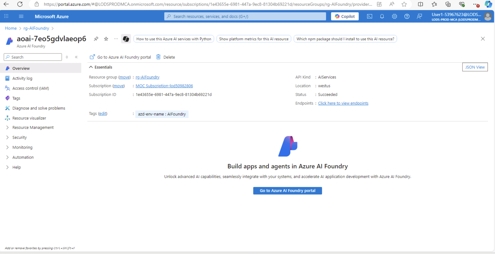
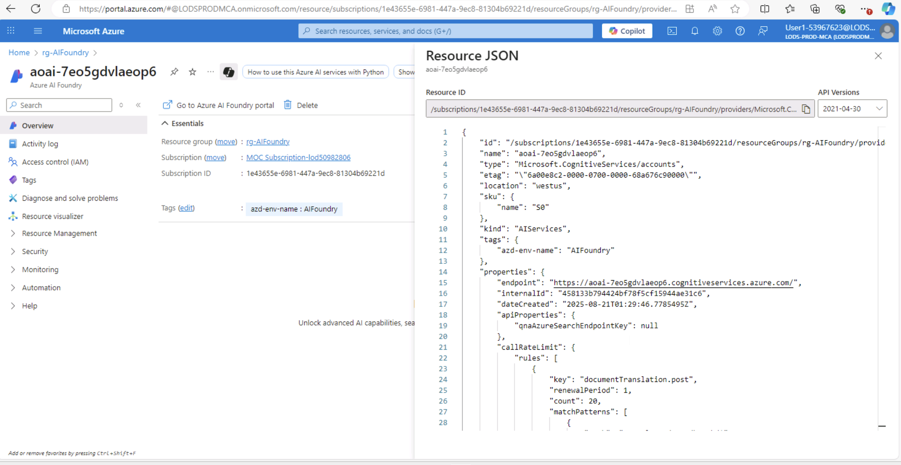
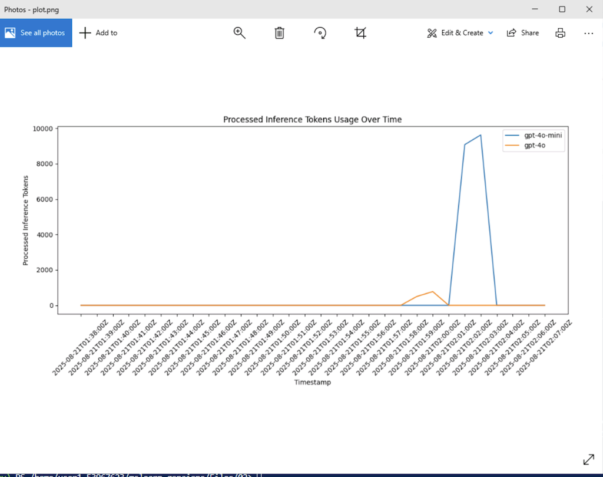
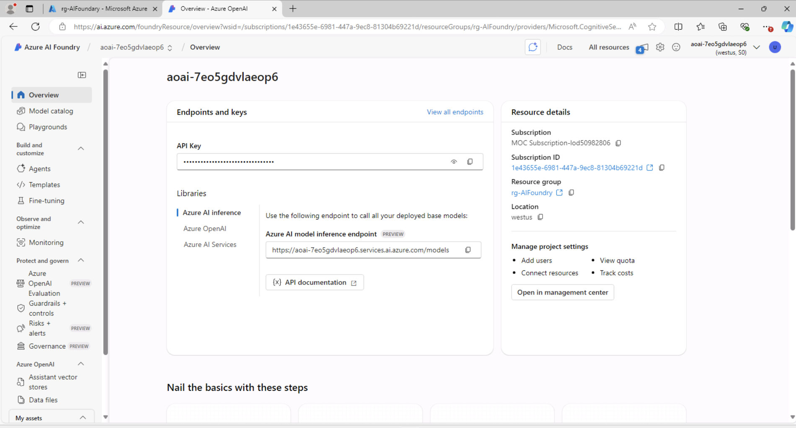

# Compare Lang Models from model catalog
- [instructions](https://github.com/MicrosoftLearning/mslearn-genaiops/blob/main/Instructions/02-Compare-models.md)

> somehow the `Compare Model` no longer appear ??


## Code
- [model1.py](https://github.com/MicrosoftLearning/mslearn-genaiops/blob/main/Files/02/model1.py)
````bash
(labenv) PS /home/user1-53967623/mslearn-genaiops/Files/02> python model1.py                                                                              

AI's response:
To replicate and save the image shown (a pie chart) using Python and matplotlib, you can use the following code:

```python
import matplotlib.pyplot as plt

# Data to plot
labels = ['maths', 'english', 'chemistry', 'physics']
sizes = [34.9, 15.9, 20.6, 28.6]
colors = ['magenta', 'cyan', 'yellow', 'red']
explode = (0.1, 0, 0, 0)  # explode 1st slice (Maths)

# Plotting the pie chart
plt.pie(sizes, explode=explode, labels=labels, colors=colors, autopct='%1.1f%%', startangle=90)
plt.axis('equal')  # Equal aspect ratio ensures pie is drawn as a circle.
plt.title('Marks obtained in an exam')

# Save the figure
plt.savefig('imgs/gpt-4o.jpg')
plt.show()
```

This code will generate a pie chart similar to the one shown and save it as a JPEG image named `gpt-4o.jpg` in the `imgs` directory. Make sure the directory exists or create it before running the code.
````

- [model2.py](https://github.com/MicrosoftLearning/mslearn-genaiops/blob/main/Files/02/model2.py)

````bash
(labenv) PS /home/user1-53967623/mslearn-genaiops/Files/02> python model2.py                                                                              

AI's response:
To create a similar pie chart and save it as an image file named `gpt-4o.jpg` under a directory called `imgs/`, you can use Python's `matplotlib` library. Below is the code that demonstrates how to do this.

```python
import matplotlib.pyplot as plt
import os

# Data to plot
labels = ['maths', 'physics', 'chemistry', 'english']
sizes = [34.9, 28.6, 20.6, 15.9]
colors = ['magenta', 'red', 'yellow', 'cyan']
explode = (0.1, 0, 0, 0)  # explode the 1st slice (maths)

# Create a pie chart
plt.figure(figsize=(6, 6))
plt.pie(sizes, explode=explode, labels=labels, colors=colors, autopct='%1.1f%%', shadow=True, startangle=140)
plt.axis('equal')  # Equal aspect ratio ensures that pie is drawn as a circle.

# Title
plt.title('Marks obtained in an exam')

# Create the directory if it doesn't exist
os.makedirs('imgs', exist_ok=True)

# Save the plot as a .jpg file
plt.savefig('imgs/gpt-4o.jpg', format='jpg')

# Show the plot (optional)
# plt.show()

# Close the plot to free memory
plt.close()
```

### Explanation:
1. **Import Libraries**: We import `matplotlib.pyplot` for plotting and `os` for directory handling.
2. **Data Input**: We defined the four subjects, their respective marks, colors for each portion of the pie chart, and decided to "explode" (offset) the slice for "maths" to highlight it.
3. **Plotting**: The `plt.pie()` method creates the pie chart. We set various parameters like the colors and percentage display.
4. **Title**: We set a title for the pie chart.
5. **Directory Handling**: We use `os.makedirs()` to ensure the `imgs` directory exists, creating it if necessary.
6. **Save Plot**: The `plt.savefig()` function saves the figure as a JPEG file in the specified directory.
7. **Optional Display**: You can uncomment `plt.show()` if you want to display the plot before saving.
8. **Cleanup**: Lastly, `plt.close()` is called to free up memory after saving the figure.

Make sure you run this code in an environment where you have write permissions to create the directory and save images.
````

- [plot.py](https://github.com/MicrosoftLearning/mslearn-genaiops/blob/main/Files/02/plot.py)




## Screenshots





